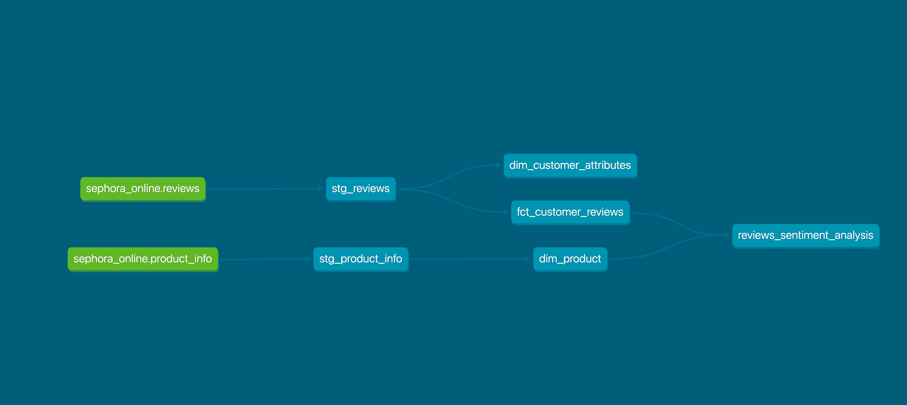

# Sephora Products and Skin Care Analytics

This dbt project performs an end-to-end analysis of Sephora products and customer reviews. It includes a sentiment analysis data model leveraging Snowflake Cortex Functions (LLMs) to extract customer sentiment and key highlights from review text. The project is structured to support analytics use cases, product insights, and user segmentation.

## Data Sources
👉 The data comes from the public [Kaggle](https://www.kaggle.com/datasets/nadyinky/sephora-products-and-skincare-reviews/) dataset and includes:

**Product Catalog:** Details on 8,000+ beauty products listed on the Sephora online store. Features include:

- Product and brand names
- Price
- Ingredients
- Ratings
- Category and feature tags

**Skincare Reviews:** Thousands of customer reviews for skincare products. Each review includes:

- Review text
- User attributes (e.g., skin tone, skin type, age)
- Review score (1 to 5 stars)
- Upvotes and downvotes from other users


## Business Questions
This project aims to answer the following key business questions:

1. What are customers saying about each product in their own words?

2. Which products have the highest and lowest average ratings?

3. Which products have received the most customer feedback?

4. Are there common suggestions or complaints that should inform product development or refinement?

5. What types of products (e.g., cleansers vs. moisturizers) are mentioned most frequently or most positively?

## Data Models Overview
The project follows a layered dbt structure with **staging**, **marts**, and **reporting** models.

```
models/
├── staging/
│   ├── stg_reviews.sql              # Cleans and standardizes raw review data
│   └── stg_product_info.sql         # Cleans product info (names, categories, prices, etc.)
│
├── marts/
│   ├── dim_customer_attributes.sql  # Builds a dimension table of customer characteristics
│   ├── dim_product.sql              # Product dimension with enriched metadata
│   └── fct_customer_reviews.sql     # Fact table combining products, customers, and reviews
│
└── reporting/
    └── reviews_sentiment_analysis.sql  # Sentiment analysis results per review using LLMs
```

### Model Layers
- **Staging** models (`stg_*`): Basic cleaning and renaming of raw data fields.

- **Marts:**
    - `dim_customer_attributes`: Extracts structured traits from reviewer metadata (e.g., age group, skin tone, etc.).
    - `dim_product`: Enriches product data with normalized attributes, categories, and pricing tiers.
    - `fct_customer_reviews`: Joins reviews to products and customers, forming the basis for analytics.

- **Reporting layer:**
    - `reviews_sentiment_analysis`: Applies LLM-powered sentiment classification and summarization to each review, enabling advanced textual analytics.


